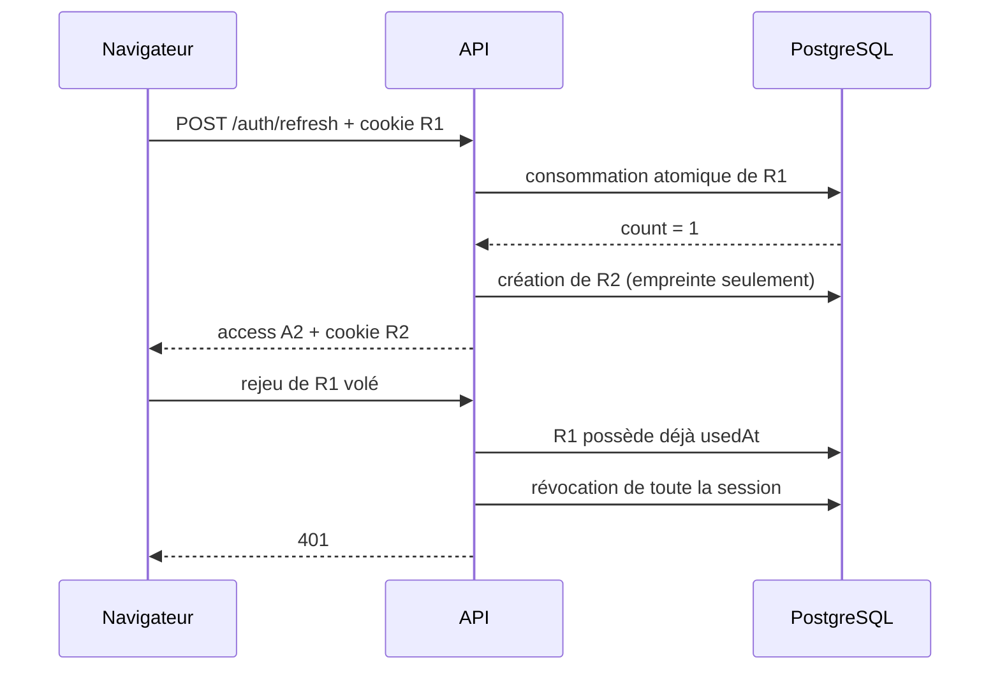

# Cours — Authentification professionnelle avec NestJS et Prisma

Ce chapitre accompagne l’implémentation du module d’authentification. Le but
n’est pas seulement de savoir appeler `jwt.sign()`, mais de comprendre les
propriétés de sécurité que le système doit garantir.

## 1. Le périmètre

Cette première version couvre une authentification locale complète par
e-mail/mot de passe :

1. création atomique d’un tenant et de son administrateur ;
2. ouverture d’une session par appareil ;
3. access token court ;
4. rotation du refresh token ;
5. révocation d’une session ou de toutes les sessions ;
6. détection d’un refresh token volé puis rejoué ;
7. validation de l’adresse e-mail ;
8. oubli, réinitialisation et changement du mot de passe ;
9. verrouillage temporaire, limitation de débit et réponses anti-énumération ;
10. authentification et autorisation par rôles pour les routes métier.

La MFA, les passkeys et les fournisseurs OIDC/SAML sont des méthodes
d’authentification supplémentaires. Elles viendront se brancher sur le même
modèle `User`/`AuthSession`, sans remettre en cause ce socle.

## 2. Authentification et autorisation

L’authentification répond à « qui appelle l’API ? ». L’autorisation répond à
« cette identité a-t-elle le droit de faire cette action ? ».

- `JwtAuthGuard`, global, authentifie toutes les routes sauf celles marquées
  explicitement `@Public()`.
- `RolesGuard` interprète les métadonnées produites par `@Roles(...)`.
- `VerifiedEmailGuard` protège les actions marquées
  `@RequireVerifiedEmail()`.
- le futur filtrage par `tenantId` assurera l’autorisation sur les données.

Un rôle ne remplace jamais l’isolation tenant. Un administrateur de la société
A ne doit pas lire une facture de la société B même si les deux ont le rôle
`ADMIN`.

## 3. Modèle de menace

Le design part des incidents réalistes suivants :

| Menace                 | Contre-mesure                                         |
| ---------------------- | ----------------------------------------------------- |
| fuite de la base       | Argon2id pour les mots de passe, HMAC pour les jetons |
| vol d’un access token  | durée courte et vérification de session en base       |
| vol d’un refresh token | cookie HttpOnly, rotation et détection de rejeu       |
| brute force            | rate limit, coût Argon2id et verrouillage temporaire  |
| découverte des comptes | réponses identiques et vérification factice           |
| vol d’un lien e-mail   | jeton aléatoire, haché, expirant et à usage unique    |
| mot de passe compromis | révocation globale après changement/reset             |
| tenant suspendu        | contrôle du statut dans le guard et au refresh        |
| champs inattendus      | `ValidationPipe` avec whitelist et rejet strict       |

La sécurité est une chaîne. Un JWT parfaitement signé n’aide pas si le mot de
passe est stocké en clair ou si une session volée ne peut jamais être révoquée.

## 4. Pourquoi deux types de JWT ?

### Access token

Il vit 15 minutes par défaut et contient :

```text
sub       identifiant utilisateur
sid       identifiant de session
email     adresse normalisée
role      rôle global/tenant
tenantId  frontière SaaS
type      "access"
iat/exp   émission et expiration
```

Il est envoyé dans `Authorization: Bearer <token>`. Le guard vérifie :

1. la signature et l’expiration ;
2. `type === "access"` ;
3. l’existence d’une session non révoquée ;
4. l’état actif de l’utilisateur ;
5. l’état `ACTIVE` ou `TRIAL` du tenant ;
6. l’absence de changement de mot de passe postérieur à `iat`.

Cette lecture en base coûte une requête, mais donne une révocation immédiate.
Une évolution à très grande échelle peut placer les sessions actives dans
Redis, sans changer le contrat HTTP.

### Refresh token

Il vit au maximum 30 jours par défaut. Il ne sert jamais à appeler une route
métier. Son unique rôle est d’obtenir un nouveau couple de tokens.

Le navigateur le conserve dans un cookie :

```text
HttpOnly     JavaScript ne peut pas le lire
Secure       HTTPS obligatoire en production
SameSite     Strict, protection CSRF adaptée à un frontend same-site
Path         /api/v1/auth
```

Le frontend conserve l’access token en mémoire, pas dans `localStorage`.

Les secrets de signature access et refresh sont distincts. Le champ `type`
empêche en plus une confusion de jetons. En production, la validation
d’environnement refuse de démarrer sans secrets indépendants.

## 5. Rotation et détection de rejeu

Un refresh token n’est utilisable qu’une fois.



L’écriture `updateMany` contient les conditions `usedAt: null` et
`revokedAt: null`. PostgreSQL garantit qu’un seul appel concurrent peut obtenir
`count = 1`. Si le même token réapparaît, le système suppose une compromission
et révoque toute la session.

Important : la révocation est validée dans la transaction avant de renvoyer le
`401`. Lever l’exception à l’intérieur de la transaction annulerait la
révocation par rollback.

La session a une expiration absolue. Une rotation ne prolonge donc pas
indéfiniment une connexion oubliée.

## 6. Pourquoi ne jamais stocker les jetons bruts ?

Un refresh token ou un lien de réinitialisation est une preuve d’identité.
Quiconque le possède peut agir comme l’utilisateur.

La base conserve :

```text
HMAC-SHA-256(AUTH_TOKEN_PEPPER, token_brut)
```

Les jetons sont déjà produits par un générateur cryptographiquement sûr et ont
une forte entropie. Un HMAC rapide est donc approprié, contrairement aux mots
de passe choisis par des humains qui exigent Argon2id. Le pepper reste hors de
la base. Une fuite SQL seule ne fournit pas de token utilisable.

## 7. Mots de passe avec Argon2id

`PasswordService` utilise Argon2id avec :

- 19 MiB de mémoire ;
- 2 itérations ;
- parallélisme 1 ;
- sortie de 32 octets.

Ces paramètres forment un point de départ raisonnable, mais doivent être
mesurés sur les serveurs de production. La bonne cible est le coût maximal
compatible avec la latence et la capacité attendues.

Le hash Argon2 encode déjà le sel et les paramètres. Il ne faut ni ajouter une
colonne `salt`, ni chiffrer le mot de passe de manière réversible.

Lorsqu’un e-mail inconnu tente de se connecter, `verifyDummy()` réalise quand
même un calcul Argon2. Cela réduit l’écart temporel entre « utilisateur absent »
et « mauvais mot de passe ».

## 8. Inscription multi-tenant atomique

`POST /api/v1/auth/register` crée dans une transaction :

1. un `Tenant` en période `TRIAL` ;
2. son premier `User` avec le rôle `ADMIN` ;
3. un jeton de validation d’e-mail ;
4. une `AuthSession` ;
5. l’empreinte du premier refresh token.

Si une étape échoue, aucune donnée partielle ne subsiste. L’e-mail est
normalisé en minuscules avant l’unicité. Le slug du tenant est normalisé puis
rendu unique.

L’envoi SMTP a lieu après le commit. Une panne du fournisseur e-mail ne doit
pas annuler un compte déjà créé ; l’utilisateur peut utiliser
`resend-verification`.

## 9. Brute force et verrouillage

La défense est superposée :

1. le rate limiting limite une adresse IP à 5 logins par minute ;
2. Argon2 rend chaque essai coûteux ;
3. après 5 erreurs pour un compte, celui-ci est verrouillé 15 minutes ;
4. le message reste toujours « E-mail ou mot de passe incorrect ».

Le rate limiting mémoire de Nest convient à une instance. Avec plusieurs
réplicas, il faut un stockage distribué comme Redis, sinon chaque instance
possède son propre compteur.

Le verrouillage peut lui-même servir à provoquer un déni de service ciblé.
C’est pourquoi il est temporaire, plafonné et combiné au rate limit IP.

## 10. Validation et récupération par e-mail

`AuthToken` sépare les usages `EMAIL_VERIFICATION` et `PASSWORD_RESET`.
Chaque jeton :

- contient 32 octets aléatoires ;
- n’existe en base que sous forme d’empreinte ;
- possède une date d’expiration ;
- possède `usedAt`, écrit atomiquement ;
- ne peut servir qu’au flux prévu par son `type`.

`forgot-password` et `resend-verification` renvoient toujours un message
générique, que l’adresse existe ou non.

Après une réinitialisation ou un changement de mot de passe :

- `passwordChangedAt` est actualisé ;
- toutes les sessions sont révoquées ;
- tous les refresh tokens sont révoqués ;
- les access tokens restants sont rejetés par le guard.

## 11. Contrat HTTP

Toutes les routes sont préfixées par `/api/v1`.

| Méthode | Route                       | Protection        | Résultat                         |
| ------- | --------------------------- | ----------------- | -------------------------------- |
| POST    | `/auth/register`            | 3/min/IP          | entreprise, admin, session       |
| POST    | `/auth/login`               | 5/min/IP          | access token + refresh cookie    |
| POST    | `/auth/refresh`             | cookie, 20/min/IP | rotation de session              |
| POST    | `/auth/logout`              | Bearer            | révocation courante              |
| POST    | `/auth/logout-all`          | Bearer            | révocation globale               |
| GET     | `/auth/me`                  | Bearer            | profil public                    |
| PATCH   | `/auth/password`            | Bearer            | changement + déconnexion globale |
| POST    | `/auth/forgot-password`     | 3/min/IP          | réponse générique `202`          |
| POST    | `/auth/reset-password`      | jeton opaque      | nouveau mot de passe             |
| POST    | `/auth/verify-email`        | jeton opaque      | e-mail vérifié                   |
| POST    | `/auth/resend-verification` | 3/min/IP          | réponse générique `202`          |
| GET     | `/auth/sessions`            | Bearer            | appareils actifs                 |
| DELETE  | `/auth/sessions/:id`        | Bearer            | révocation ciblée                |

Exemple d’inscription :

```bash
curl -i -c cookies.txt \
  -H "Content-Type: application/json" \
  -d '{
    "email": "ada@acme.fr",
    "password": "UnePhrase!Solide42",
    "firstName": "Ada",
    "lastName": "Lovelace",
    "companyName": "Acme SARL"
  }' \
  http://localhost:3000/api/v1/auth/register
```

Le fichier `cookies.txt` simule le coffre de cookies du navigateur :

```bash
curl -i -b cookies.txt -c cookies.txt \
  -X POST http://localhost:3000/api/v1/auth/refresh
```

## 12. Organisation du code

| Fichier                   | Responsabilité                        |
| ------------------------- | ------------------------------------- |
| `prisma/schema.prisma`    | identité, sessions et tokens          |
| `auth.service.ts`         | cas d’usage et transactions           |
| `auth-token.service.ts`   | JWT, aléatoire et empreintes          |
| `password.service.ts`     | Argon2id                              |
| `auth-mail.service.ts`    | SMTP et liens frontend                |
| `auth.controller.ts`      | contrat HTTP et cookies               |
| `jwt-auth.guard.ts`       | authentification de chaque requête    |
| `roles.guard.ts`          | autorisation par rôles                |
| `verified-email.guard.ts` | e-mail exigé sur les routes sensibles |
| `auth.dto.ts`             | validation des entrées                |
| `env.validation.ts`       | politique de démarrage sécurisé       |

Le contrôleur reste mince : il traduit HTTP vers les cas d’usage. Les
transactions et règles métier restent dans le service. La cryptographie est
isolée pour être testée et remplacée sans contaminer le domaine.

## 13. Configuration et secrets

Copier `.env.example` vers `.env.development`, puis remplacer chaque secret :

```bash
openssl rand -base64 48
```

Ne réutilisez jamais le même secret pour access, refresh et pepper. En
production :

- injecter les secrets depuis le gestionnaire de secrets de la plateforme ;
- mettre `COOKIE_SECURE=true` et servir uniquement en HTTPS ;
- restreindre précisément `CORS_ORIGINS` ;
- régler `TRUST_PROXY_HOPS` au nombre réel de proxies devant l’API, sinon
  conserver `0` pour empêcher l’usurpation de l’IP utilisée par le rate limit ;
- configurer SMTP ;
- ne pas exposer Swagger publiquement ;
- renouveler tout secret déjà commité dans Git.

Le dépôt contenait déjà un `.env.development` suivi par Git. L’ajout du motif
`.env.*` évite les nouveaux fichiers, mais un fichier déjà suivi reste suivi.
Après avoir sauvegardé ses valeurs dans un coffre, exécuter :

```bash
git rm --cached .env.development
```

Puis renouveler `DATABASE_URL`, les secrets JWT, le pepper et les identifiants
SMTP avant tout déploiement.

## 14. Migration et validation

Le dépôt fournit une migration initiale :

```bash
npx prisma migrate dev
npx prisma generate
npm run build
npm test -- --runInBand
```

Si une base existante a été créée avec `prisma db push`, ne lancez pas la
migration initiale aveuglément. Comparez son schéma, sauvegardez-la, puis
établissez une baseline Prisma avant `migrate deploy`.

Dans l’environnement audité, la base locale contient déjà deux migrations
absentes du dépôt (`20260701174716_init` et
`20260709121304_make_user_password_required`). Il faut récupérer ces deux
dossiers depuis leur source d’origine avant d’ajouter une migration
incrémentale. À défaut, utilisez une nouvelle base locale pour la migration
initiale. Un `migrate reset` détruit les données et ne doit être lancé qu’après
une décision explicite et une sauvegarde.

Les tests vérifient notamment :

- Argon2id et la vérification de mot de passe ;
- la séparation access/refresh ;
- l’empreinte des tokens ;
- l’anti-énumération ;
- le compteur d’échecs ;
- la révocation sur rejeu ;
- le refus d’un refresh sans cookie.

## 15. Limites conscientes et prochaines étapes

Le socle est prêt pour les modules métier. Avant une mise en production à fort
enjeu, les étapes suivantes sont recommandées :

1. tests e2e sur une base PostgreSQL éphémère en CI ;
2. rate-limit distribué Redis ;
3. tâches de purge des tokens/sessions expirés ;
4. journal d’audit immuable des événements de sécurité ;
5. MFA TOTP/WebAuthn et codes de récupération ;
6. notification lors d’une nouvelle connexion ;
7. gestion de clés avec `kid` et rotation planifiée ;
8. politiques d’autorisation fines par permission ;
9. observabilité sans journaliser mots de passe, cookies ou tokens ;
10. revue OWASP ASVS avant lancement.

Le principe à conserver pour la suite est simple : toute donnée métier reçoit
un `tenantId`, toute requête le filtre côté serveur, et aucune valeur tenant
envoyée par le client n’est considérée comme une preuve d’autorisation.
