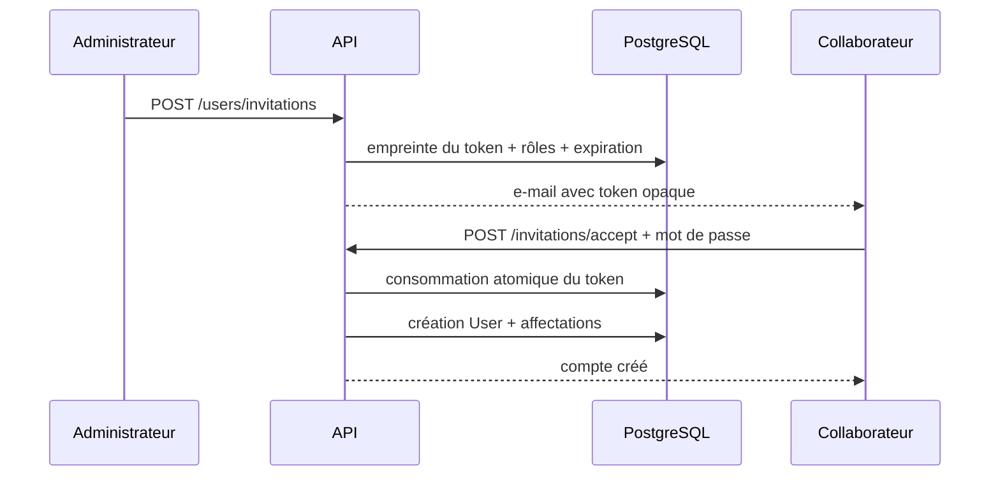

# Cours — Gestion des utilisateurs, rôles et permissions

Ce chapitre explique l’implémentation IAM ajoutée au backend SaaS. IAM signifie
« Identity and Access Management » : le système ne se contente plus de savoir
qui est connecté, il détermine précisément ce que cette personne peut faire
dans son entreprise.

## 1. Objectifs métier et sécurité

Le module permet :

1. de lister et consulter les collaborateurs d’un tenant ;
2. d’inviter un collaborateur sans choisir son mot de passe à sa place ;
3. de modifier son profil administratif ;
4. de l’activer ou le suspendre ;
5. de révoquer toutes ses sessions ;
6. de créer des rôles personnalisés ;
7. d’affecter plusieurs rôles à un utilisateur ;
8. de composer les rôles avec des permissions atomiques ;
9. de tracer les mutations sensibles dans un journal d’audit.

Les propriétés attendues sont plus importantes que le nombre d’endpoints :

- aucune requête ne choisit son `tenantId` ;
- une permission révoquée cesse de fonctionner immédiatement ;
- un manager ne peut pas promouvoir quelqu’un au-dessus de lui ;
- personne ne peut s’auto-désactiver ou modifier ses propres rôles ;
- un tenant conserve toujours un administrateur actif ;
- un rôle système ne peut pas être altéré ;
- un acteur ne peut pas déléguer un droit qu’il ne possède pas.

## 2. RBAC : rôles et permissions

RBAC signifie « Role-Based Access Control ».

```text
Utilisateur -> Affectations -> Rôles -> Permissions
```

Une permission représente une action atomique stable :

```text
users.read
users.invite
users.change-status
roles.create
roles.manage-permissions
audit.read
```

Un rôle est un regroupement tenant-scoped de permissions. Un utilisateur peut
cumuler plusieurs rôles. Ses permissions effectives sont l’union de leurs
permissions.

### Pourquoi ne pas mettre les permissions dans le JWT ?

Un JWT signé reste valide jusqu’à son expiration. Si ses permissions y étaient
copiées, un collaborateur conserverait un droit retiré pendant plusieurs
minutes.

Ici, `JwtAuthGuard` charge la session, les rôles et les permissions depuis
PostgreSQL à chaque requête. Le JWT prouve l’identité et la session ; la base
représente l’état d’autorisation courant.

À plus grande échelle, ce calcul peut être mis en cache dans Redis avec une
invalidation événementielle. Le modèle de sécurité reste le même.

## 3. Modèle hybride et compatibilité

Le champ historique `User.role` est conservé :

```text
SUPER_ADMIN
ADMIN
MANAGER
USER
```

Il sert de niveau système grossier et maintient la compatibilité avec
l’authentification existante. Les permissions réelles viennent toutefois des
tables dynamiques :

| Table                   | Responsabilité                    |
| ----------------------- | --------------------------------- |
| `permissions`           | catalogue global des actions      |
| `roles`                 | rôles appartenant à un tenant     |
| `role_permissions`      | permissions composant un rôle     |
| `user_role_assignments` | rôles attribués aux utilisateurs  |
| `user_invitations`      | invitations temporaires           |
| `invitation_roles`      | rôles proposés par une invitation |
| `audit_logs`            | événements IAM append-only        |

Lors d’une affectation, `User.role` est synchronisé avec le rôle système le
plus élevé. Un rôle personnalisé ne remplace pas cette source de permissions :
il la complète.

## 4. Rôles système et rang hiérarchique

Chaque tenant reçoit trois rôles immuables :

| Rôle           | Rang | Droits                                                        |
| -------------- | ---: | ------------------------------------------------------------- |
| Administrateur |  100 | toutes les permissions IAM                                    |
| Manager        |   50 | lecture, invitation, édition simple et consultation des rôles |
| Utilisateur    |   10 | aucun droit administratif                                     |

Les rôles personnalisés utilisent un rang de 1 à 90.

Le rang ne donne pas automatiquement des permissions. Il limite uniquement les
personnes et rôles qu’un acteur peut administrer. Un acteur non administrateur
ne peut ni gérer une cible de rang égal ou supérieur, ni attribuer un rôle de
rang égal ou supérieur au sien.

Les administrateurs peuvent créer un autre administrateur, mais les managers
ne peuvent pas créer leurs pairs. Cette règle permet d’ajouter un second
administrateur tout en empêchant une escalade horizontale des managers.

## 5. Authentification globale, publique par exception

L’ordre des guards NestJS est :

```text
guards globaux -> guards contrôleur -> guards méthode
```

Un `PermissionsGuard` global ne peut donc pas dépendre d’un `JwtAuthGuard`
déclaré uniquement sur un contrôleur : le premier s’exécuterait trop tôt.

La solution implémentée est plus sûre :

1. `JwtAuthGuard` est global ;
2. toute route est privée par défaut ;
3. seules les routes marquées `@Public()` échappent à l’authentification ;
4. `RolesGuard`, `VerifiedEmailGuard` et `PermissionsGuard` s’exécutent ensuite.

Exemple :

```typescript
@Get()
@RequirePermissions(PERMISSIONS.USERS_READ)
listUsers() {}
```

Une future route oubliant `@UseGuards` reste donc protégée. L’oubli dangereux
devient l’ajout explicite et visible de `@Public()`.

## 6. Isolation tenant

Le `tenantId` provient exclusivement de `request.user`, construit par le guard.
Les paramètres et corps HTTP ne peuvent jamais sélectionner un autre tenant.

```typescript
const where = {
  tenantId: actor.tenantId,
  // autres filtres
};
```

Les recherches d’utilisateur et de rôle combinent toujours l’identifiant et le
tenant :

```typescript
where: {
  id: (userId, tenantId);
}
```

Lors du chargement des permissions, le guard filtre une seconde fois les rôles
dont `role.tenantId !== user.tenantId`. Cette défense en profondeur empêche une
incohérence de données d’accorder un droit inter-tenant.

## 7. Invitation professionnelle

Un administrateur ne choisit jamais le mot de passe d’un collaborateur.



Le token brut :

- contient 32 octets aléatoires ;
- est envoyé uniquement par e-mail ;
- n’est jamais stocké en base ;
- est remplacé par une empreinte HMAC ;
- expire après sept jours par défaut ;
- possède `acceptedAt` ou `revokedAt` ;
- ne peut être consommé qu’une fois grâce à un `updateMany` conditionnel.

Accepter le lien prouve l’accès à l’adresse e-mail. Le compte est donc créé
avec `emailVerifiedAt`.

Une nouvelle invitation à la même adresse révoque automatiquement l’ancienne.
La contrainte unique globale sur `User.email` empêche une double acceptation
concurrente.

La hiérarchie s’applique aussi aux invitations : un manager ne peut ni voir,
ni révoquer, ni remplacer une invitation portant un rôle de niveau égal ou
supérieur. Sans cette règle, il pourrait neutraliser une invitation
administrateur en réinvitant la même adresse avec un rôle inférieur.

## 8. Affectation des rôles

`PUT /users/:userId/roles` remplace l’ensemble des rôles dans une transaction :

1. vérifier que la cible appartient au tenant ;
2. refuser la modification de ses propres rôles ;
3. charger tous les rôles demandés dans le même tenant ;
4. comparer leur nombre au nombre d’identifiants reçus ;
5. vérifier les rangs ;
6. préserver le dernier administrateur actif ;
7. supprimer les anciennes affectations ;
8. créer les nouvelles ;
9. synchroniser `User.role` ;
10. écrire l’événement d’audit.

Comparer les cardinalités est important. Une requête SQL `id IN (...)` ignore
simplement les identifiants étrangers ; sans comparaison, une affectation
partielle pourrait être acceptée silencieusement.

## 9. Délégation sans escalade

Lors de la création ou modification des permissions d’un rôle :

```typescript
requested.every((permission) => actor.permissions.includes(permission));
```

Cette règle empêche un utilisateur possédant `roles.create` mais pas
`users.change-status` de fabriquer un rôle contenant
`users.change-status`.

Le `SUPER_ADMIN` de plateforme possède un bypass explicite. Un super-admin sans
contexte tenant ne peut cependant pas utiliser les routes tenant. Une future
API de support plateforme devra sélectionner le tenant par un mécanisme
séparé, audité et fortement protégé.

## 10. Suspension et sessions

La désactivation d’un utilisateur est une transaction :

1. `isActive` passe à `false` ;
2. toutes les `AuthSession` actives sont révoquées ;
3. tous les refresh tokens actifs sont révoqués ;
4. l’événement est audité.

Même si un access token existe encore, `JwtAuthGuard` relit `isActive` et la
session. La suspension prend effet immédiatement.

L’API empêche :

- l’auto-désactivation ;
- la désactivation d’une cible hiérarchiquement inaccessible ;
- la désactivation du dernier administrateur actif.

## 11. Rôles système et rôles personnalisés

Les rôles système sont provisionnés à l’inscription d’un tenant et par la
migration pour les tenants existants. L’API interdit leur modification ou
suppression.

Un rôle personnalisé peut être supprimé seulement s’il :

- n’est attribué à aucun utilisateur ;
- n’est référencé par aucune invitation encore active.

Les liens des invitations expirées ou révoquées peuvent être supprimés en
cascade. L’événement `role.deleted` conserve le nom du rôle dans le journal
d’audit.

## 12. Journal d’audit

`AuditLog` enregistre :

```text
tenantId
actorUserId
action
targetType
targetId
metadata
createdAt
```

Exemples d’actions :

```text
user.invited
user.invitation-accepted
user.deactivated
user.roles-assigned
user.sessions-revoked
role.created
role.permissions-updated
role.deleted
```

Les écritures d’audit sont dans la même transaction que la mutation. Une
opération métier ne peut donc pas réussir sans sa trace.

Le modèle est append-only au niveau applicatif : aucun endpoint ne modifie ou
supprime un audit. Pour des exigences réglementaires fortes, la prochaine
étape consiste à exporter les événements vers un stockage WORM ou un SIEM.

## 13. Contrat HTTP

Toutes les routes utilisent le préfixe `/api/v1`.

### Utilisateurs et invitations

| Méthode | Route                    | Permission              |
| ------- | ------------------------ | ----------------------- |
| GET     | `/users`                 | `users.read`            |
| GET     | `/users/:id`             | `users.read`            |
| PATCH   | `/users/:id`             | `users.update`          |
| PATCH   | `/users/:id/status`      | `users.change-status`   |
| PUT     | `/users/:id/roles`       | `users.assign-roles`    |
| DELETE  | `/users/:id/sessions`    | `users.revoke-sessions` |
| POST    | `/users/invitations`     | `users.invite`          |
| GET     | `/users/invitations`     | `users.invite`          |
| DELETE  | `/users/invitations/:id` | `users.invite`          |
| POST    | `/invitations/accept`    | route publique limitée  |

### Rôles, permissions et audit

| Méthode | Route                    | Permission                 |
| ------- | ------------------------ | -------------------------- |
| GET     | `/roles`                 | `roles.read`               |
| GET     | `/roles/:id`             | `roles.read`               |
| POST    | `/roles`                 | `roles.create`             |
| PATCH   | `/roles/:id`             | `roles.update`             |
| PUT     | `/roles/:id/permissions` | `roles.manage-permissions` |
| DELETE  | `/roles/:id`             | `roles.delete`             |
| GET     | `/permissions`           | `permissions.read`         |
| GET     | `/audit-logs`            | `audit.read`               |

Les routes administratives exigent également une adresse e-mail vérifiée.

## 14. Exemples

Créer un rôle :

```bash
curl -X POST http://localhost:3000/api/v1/roles \
  -H "Authorization: Bearer $ACCESS_TOKEN" \
  -H "Content-Type: application/json" \
  -d '{
    "name": "Commercial senior",
    "rank": 30,
    "permissionKeys": ["users.read"]
  }'
```

Inviter un utilisateur :

```bash
curl -X POST http://localhost:3000/api/v1/users/invitations \
  -H "Authorization: Bearer $ACCESS_TOKEN" \
  -H "Content-Type: application/json" \
  -d '{
    "email": "grace@acme.fr",
    "firstName": "Grace",
    "lastName": "Hopper",
    "roleIds": ["ROLE_ID"]
  }'
```

## 15. Migration et provisionnement

La migration `20260728120000_user_management_rbac` :

1. crée les sept tables IAM ;
2. insère le catalogue global des permissions ;
3. crée les trois rôles système pour chaque tenant existant ;
4. affecte toutes les permissions aux administrateurs ;
5. affecte le sous-ensemble prévu aux managers ;
6. convertit le champ historique `User.role` en affectations dynamiques.

L’inscription d’un nouveau tenant appelle `provisionTenantRbac()` dans la même
transaction que la création de l’administrateur.

La base locale auditée possède toujours deux migrations anciennes absentes du
dépôt. Ne lancez pas `migrate deploy` ou `migrate reset` avant d’avoir récupéré
ces dossiers ou choisi une nouvelle base de développement.

## 16. Tests et points d’extension

Les tests ajoutés couvrent :

- l’exigence de toutes les permissions déclarées ;
- le bypass explicite du super-admin ;
- l’injection forcée du tenant dans les listes ;
- l’interdiction de s’auto-désactiver ;
- le rejet des rôles provenant d’un autre tenant ;
- l’immutabilité des rôles système ;
- l’interdiction de déléguer une permission absente ;
- la protection d’un rôle encore affecté.

Prochaines extensions possibles :

1. pagination par curseur pour de très gros tenants ;
2. cache Redis des permissions avec invalidation ;
3. politiques ABAC pour les droits dépendant d’un document ;
4. workflow d’approbation pour les rôles à privilèges élevés ;
5. rôle propriétaire non transférable sans confirmation MFA ;
6. export SIEM du journal d’audit ;
7. expiration automatique et purge des invitations.
